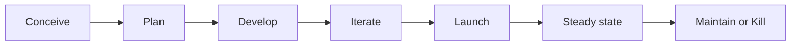

[udemy：Become a Product Manager](https://www.udemy.com/course/become-a-product-manager-learn-the-skills-get-a-job/)

「俞军产品方法论」

## 什么是产品经理

- 内部产品
- 面向消费者2C
- 面向企业2B

思考公司需要什么产品，用户有什么需求，做一款产品的目的是什么？在这些前提下还要进行一定的决策，因为不是所有的需求都能马上实现（尽管对用户和公司来说是双赢），而要进行优先级的排列，通过调研、用户测试等手段将需求划分的更清晰。不同人群在不同情境下会有不同的需求，而对公司来说又有长期目标、短期目标的区分，有物质收益、名誉收益等考量。这些因素都需要产品经理来统筹考量，在综合所有外部条件内部条件情况下不断提升自己的认知，减少决策中的不确定因素，来达成综合利益的最大化。 

实际工作中，产品经理往往也要兼任一些项目经理的工作，比如协调设计师、工程师等部门的合作，推进更好地完成任务。

> 项目经理和产品经理区别？
>
> 产品经理侧重于目标的决策，而项目经理负责推动这个目标的实现，比如协调各个部门按时推进项目进度

## 产品开发流程

- Conceive：前期头脑风暴用户调研发现需求
- Plan：通过市场调研等手段规划路线图
- Develop：确定初期要实现的特性并开发
- Iterate：收集用户反馈不断迭代产品
- Launch：联合市场营销法务等部门正式发布产品
- Steady state：收集日常的指标，对产品进行优化
- Maintain or Kill：一段时间后产品可能效益很好那就继续维护，也可能持续亏损或者公司业务转向那就要收拾残局

### Agile

类似MVP(Minimal Viable Product)，完成产品核心功能开发后，快速将产品上线，根据用户反馈来快速迭代

### Waterfall

尽可能让产品在交付给客户之前足够完善，适用于一些需求清楚的产品，或是像操作系统、工业软件这类可靠性和完整性要求较高的产品

## 需求

用户的需求并不一定是真实的需求，原因是很多情况人们都不懂自己要什么，产品经理要不断地提问真正的需求是什么。

需求来自于外部和内部。

## 产品经理的思考角度

价值判断有时候要辅以一些权衡视角来提高主观判断质量

### 对自我认知的认知

产品经理不断提高自己的认知是一方面，对「自我认知的认知」也要尽量准确。对自己思维局限、所处客观环境、概率估计要有正确的认知，这使我们在决策时更加理性

### 对给定目标的批判性思考

keep asking why？我为什么要做这件事？做这件事的真正目的是为了解决什么问题？为什么不能换成其他目标？不断逼近问题的核心

### 参照系

参照系严重影响用户价值大小。用户价值判断是基于什么？他们使用竞品之后所产生的「旧体验」会如何影响到产品？

### 成本

只谈收益或者只谈成本都会带来偏见，成本有直接成本、交易成本、机会成本、风险成本

### 不确定性决策

尊重世界的不确定性，很多决策的结果取决于无数个体和群体的未来决策

### 概率（风险判断）

你认为的概率不一定是真实的概率，产品经理重要的职责之一就是运用自己的专业能力和认知不断使这个概率贴近真实的期望。在判断预期效用时有公式：（收益 - 各种成本）× 概率 = 预期效用

### 非货币价值

不仅仅是金钱因素，各种属性都因被纳入考量的范围

## 当一个好的产品经理

### 思维框架

形成自己的一套「思维体系」很重要，要把细散零碎的思考系统化结构化，成为自己思考问题的标准化流程。不成体系，没有经过整理的知识是低效率的，你只能想到哪是哪，很可能考虑问题不够全面，没有悟出规律性的东西只能叫经历，而不是指导未来的经验。

### 用户模型

通过大量的案例积累、亲自体验、用户反馈、迭代验证等环节足够了解你的用户，这一过程没有捷径，只能从大量实践中积累。

### 交易模型

优秀的产品经理在致力于提升用户体验时也要考虑到公司经营的可持续性，创造出用户愿意为之买单的用户价值。

### 科学方法

掌握理性决策的科学方法，在日常生活和工作中熟练应用逻辑和概率，减少认知偏差。

### 人文关怀

### 批判性思维 

### 实践精神

产品经理是实践性职业，所有工作的目标都要能由实践验证，并在反馈中修改迭代。所有不方便实践验证的，不论是因为成本还是其他原因导致的具有低可行性的想法和规划，对于产品经理来说都是低价值的，这是跟咨询、战略、分析、投资、策划、设计等岗位差异最大的地方。产品经理也重视想法和创意，也重视规划性工作，也重视研究不易验证的用户心理动机，但是，产品经理做这些工作都要对结果负责，要以终为始，一开始就考虑落地可行性，所以实践精神对产品经理特别关键

## 补充点

- 互联网的变现模式：1.广告变现；2.增值服务；3.平台佣金；4.买卖差价；5.金融
